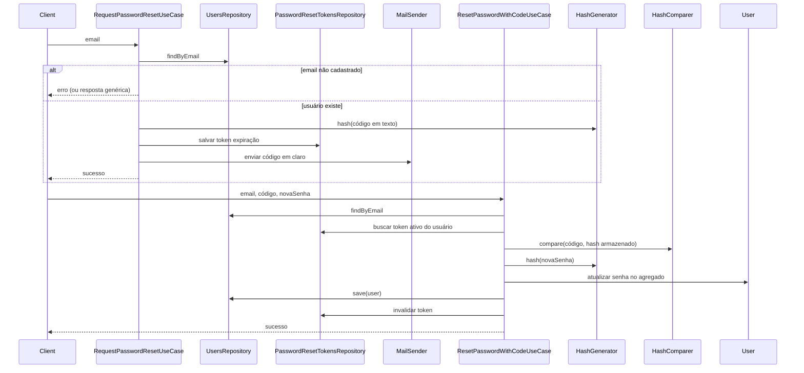

# Plano: esqueci minha senha + redefinir senha (domínio + application)

## Visão do fluxo

## Decisões alinhadas ao repositório

- **Padrão dos auth use cases**: entrada com `Email` onde fizer sentido, retorno `Either<Erro, Sucesso>` como em `login-with-credentials.ts`.
- **Reutilizar** `UsersRepository`, `HashGenerator` e `HashComparer`: o código enviado por e-mail é persistido **somente em hash**; na redefinição, comparar com `HashComparer`.
- **E-mail**: port `MailSender` na application; implementação real fica na infra; testes usam fake.

## Domínio (`accounts`)

1. **Entidade `PasswordResetToken`**: `userId`, `hashedCode`, `expiresAt`; método `isExpired(reference: Date)`.
2. **`User.changePassword(hashedPassword)`**: atualiza hash e `touch()`; permite usuário só OAuth (`hashedPassword === null`) definir primeira senha local.

## Application — ports

| Port                            | Responsabilidade                                                                                |
| ------------------------------- | ----------------------------------------------------------------------------------------------- |
| `PasswordResetTokensRepository` | Um token ativo por usuário: substituir ao novo pedido; buscar por `userId`; remover após reset. |
| `MailSender`                    | Enviar e-mail com o código em texto.                                                            |
| `ResetCodeGenerator`            | Gerar código (ex.: 6 dígitos); fake fixo nos testes.                                            |

**TTL**: ~15 minutos (configurável no construtor do use case de pedido).

## Casos de uso

### `RequestPasswordResetUseCase`

- Entrada: `email: Email`.
- Se usuário não existe: `left(ResourceNotFoundError({ resource: "user" }))` — permite enumeração de e-mails; alternativa futura é sempre `right` e não enviar e-mail se não houver usuário.
- Se existe: gerar código, hash, persistir token, enviar e-mail, `right`.

### `ResetPasswordWithCodeUseCase`

- Entrada: `email`, `code`, `newPassword`.
- Falhas agregadas em `InvalidOrExpiredPasswordResetCodeError` (usuário inexistente, token ausente, expirado ou código incorreto).
- Sucesso: hash da nova senha, `user.changePassword`, `save`, remover token.

## Fora deste documento (infra)

- Controller HTTP, rate limiting, SMTP/SES, tabela `password_reset_tokens`.

## Implementação no repositório

- Entidade: `src/modules/accounts/domain/entities/password-reset-token.ts`
- Ports: `src/modules/application/repositories/` (`password-reset-tokens-repository.ts`, `mail-sender.ts`, `reset-code-generator.ts`, `numeric-reset-code-generator.ts`)
- Use cases: `src/modules/application/use-cases/auth/request-password-reset.ts`, `reset-password-with-code.ts`
- Erro: `src/shared/errors/invalid-or-expired-password-reset-code-error.ts`
- Testes: fakes e in-memory em `tests/repositories/`, specs junto aos use cases
